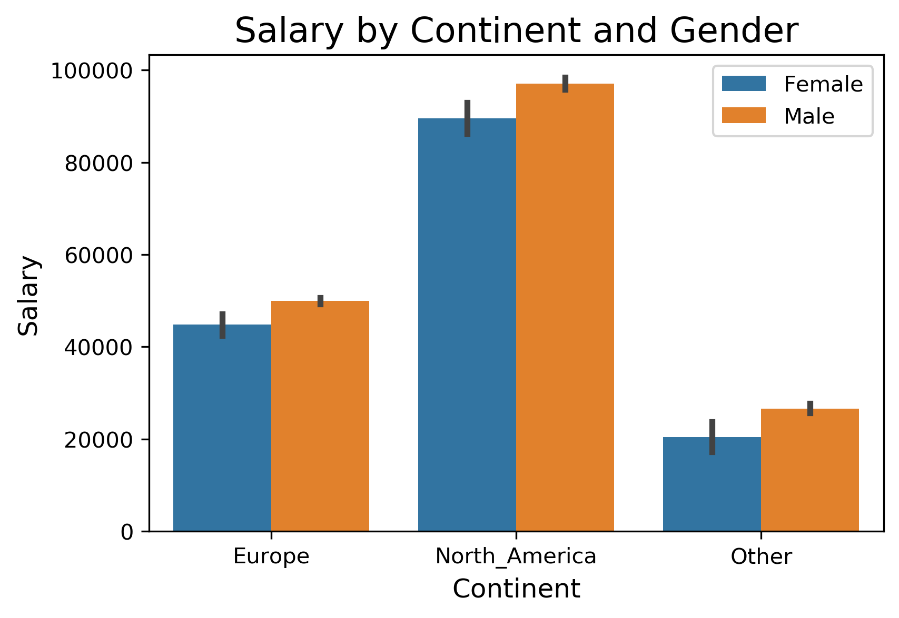
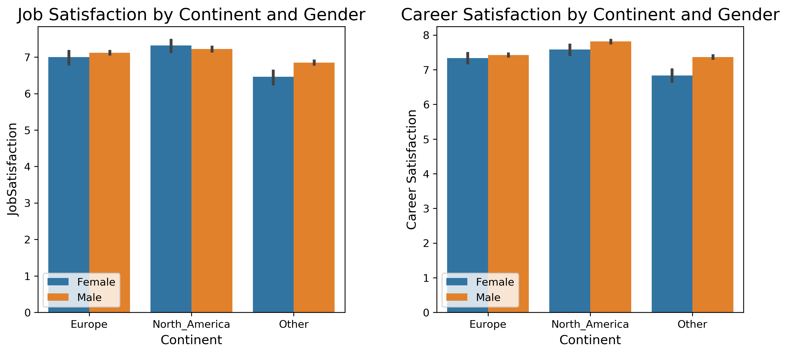
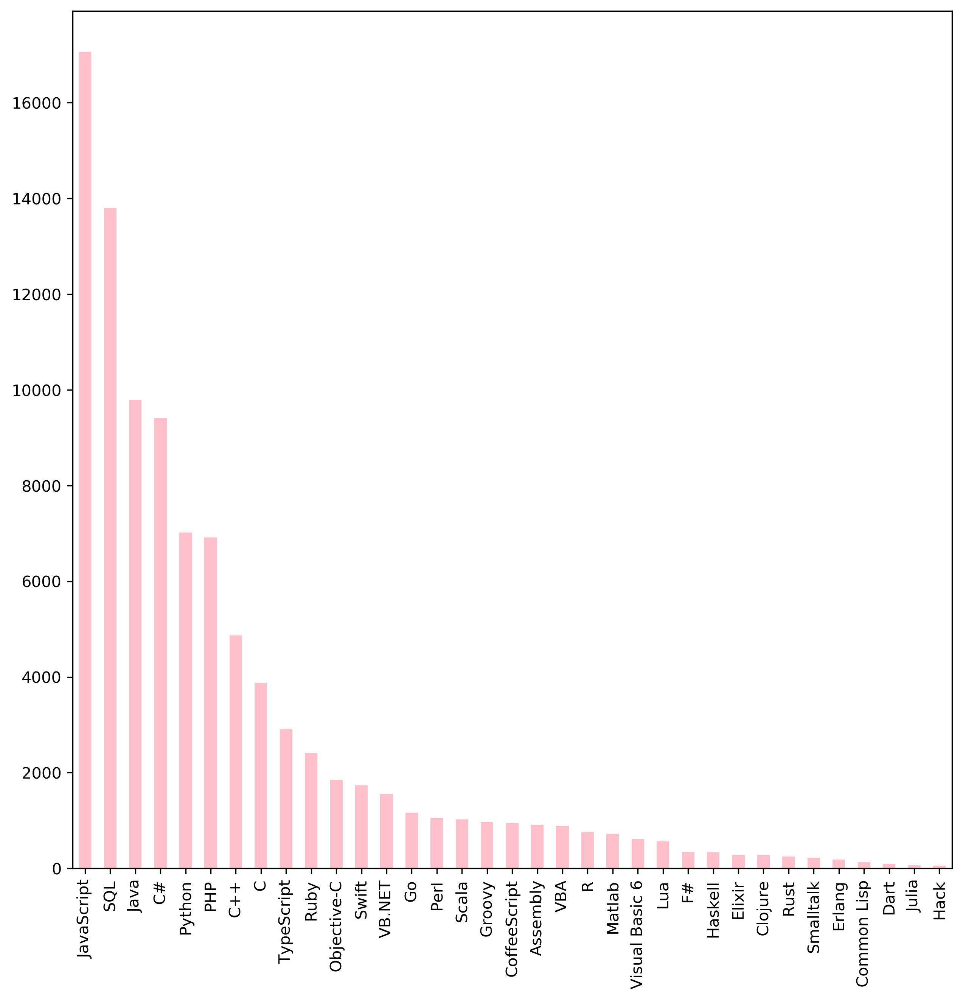

# Udacity | Data Scientist Nanodegree |  
# Project 1 - Write A Data Science Blog Post
# If you could chose, would you prefer to be a male or female programmer & where would you be born?
**Creation date: 07.11.2020  
Created by Michelle Leemans**

Within this first project of the Udacity Data Scientist Nanodegree, I investigated the Stack Overflow data from 2017. Within this data analysis 3 specific questions were answered:

1. Do programmers have equal salary in Europe and North America and is there a 'gender gap'?
1. Do programmers have equal satisfaction score (both career or job) in Europe and North America and is there a 'gender gap'?
1. What are the most common used languages worldwide?

## Question I |Do programmers have equal salary in Europe and North America and is there a 'gender gap'?

When plotting the salaries of both male and female programmers in different continents we make two observations:
1. Programmers working in North America (United States + Canada) earn almost double of programmers who work in the Europe and 4 times double than people working on the other continents (including India).  

1. Whatever which continent, men on average gain more money as a programmer compared to women.

## Question II | Do programmers have equal satisfaction score (career or job) in Europe and North America and is there a 'gender gap'?

When plotting the satisfaction rates of both male and female programmers in different continents we make two observations:

1. Both job satisfaction and career satisfaction are on average lower in women compared to men this can be explained mainly by a lower satisfaction of women in other continents rather than Europe or North America.

1. Both job and career satisfaction scores are the highest in North America, closely followed by Europe. The lowest satisfactions scores are found in other continents.

## Question III | What are the most common used languages?

The most used language worldwide is JavaScript, followed by SQL, and Java. Python is the 5th most used languaged following the Stackoverflow data of 2017.

## Conclusion
In this article, we took a look at why  Stack Overflow 2017 survey data and concluded the following:

1. Programmers working in North America earn the most and have the highest job and career satisfaction scores.

1. Whatever which continent, male programmers on average gain more money and are more satisfied  compared to female programmers.

1. The most common language used is JavaScript.

If you could chose, would you prefer to be a male or female programmer & where would you be born?
I guess the answer is pretty obvious..

To see more about this analysis, see the link to my Github available here.
